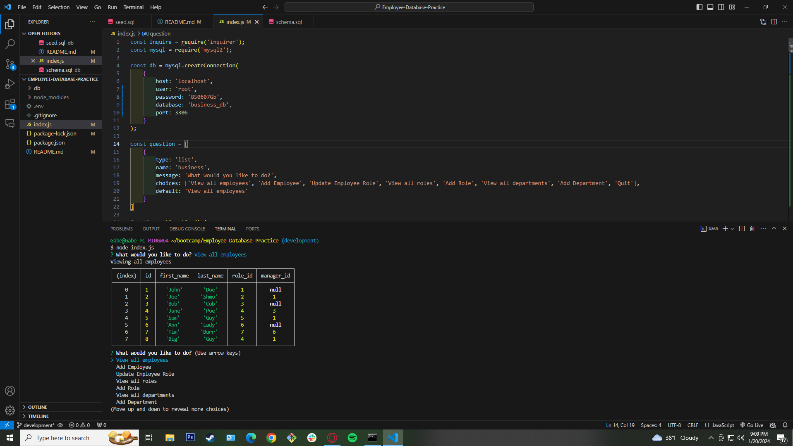

# Employee Database Practice

## Description
This is a simple terminal ran app that can view, add, and update various facets of business info such as departments, emplyess, and those employees roles.

## Motivation
I wanted to get some practice in with MySQL along with queries to the database for functionality of updating databases from client actions on an app.

## Table of Contents
- [Installation](#installation)
- [Usage](#usage)
- [Credits](#credits)
- [License](#licenses)
- [Questions](#questions)

## Installation
When you clone the code you'll want to run an `npm i` in your terminal. Then, run `mysql -u root -p` and sign in to your MySQL. Source both the schema and seed sql files in that order with command `source db/______`.Once you've done that, exit sql by typing `quit`. The cide should be ready to use.

## Usage
Run `node index.js` in your terminal. After that, you'll be given a list of actions to choose from. Choose whichever you want and provide the information asked for. The database will change based on whatever actions you choose!

Here's a link to a demo video: https://drive.google.com/file/d/1kM750vxjF_nXWkBNddF1FtRN4-WSg1LK/view?usp=sharing

## Credits
https://dev.mysql.com/doc/ - MySQL Docs   https://sidorares.github.io/node-mysql2/docs/documentation - MySQL2 Docs

## Licenses
This project is covered by the MIT license.

## Testing

## Questions 
If you have any questions or would like to reach out for any reason, please feel free!
My Email: barrettg516@gmail.com

Github: g-barrett (https://github.com/g-barrett)
